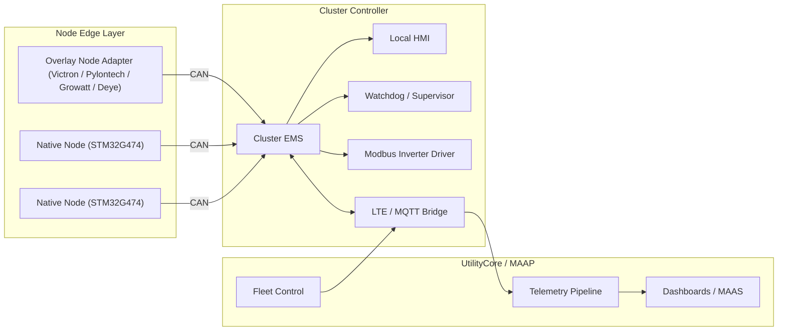

# ClusterStore Architecture

## System Context

ClusterStore has three software layers that operate as one coordinated system:

## Runtime Responsibilities

### 1. Node-Level Firmware

ClusterStore supports two node-edge modes:

- Native STM32G474 nodes that run the portable firmware core directly.
- Overlay nodes that normalize existing BESS assets through Modbus or CAN-BMS adapters.

For the native path, each PowerHive node remains responsible for:

- Battery protection and BMS enforcement.
- MPPT and local power conversion loops.
- CAN heartbeat, status, diagnostics, and cluster command handling.
- Failing safe if the cluster controller stops supervising it.

Cluster-specific additions in this repository:

- Shared CAN message definitions.
- Cluster-aware node operating states.
- Supervision timeout behavior that returns the node to standalone-safe logic.
- Portable boot-control, flash journal, and platform-vtable modules under `firmware/clusterstore-firmware/`.

### Current Implementation Status

- The portable firmware modules under `firmware/clusterstore-firmware/lib/` now build and pass host-side validation on Windows.
- The STM32G474 BSP, bench image, bootloader image, and native node image targets exist and configure for ARM builds.
- The HAL-backed target build still waits on the real STM32Cube `Drivers/` tree.
- The native STM32 app and bootloader targets still bridge through the older `firmware/node-firmware` runtime instead of running directly on the new host-validated portable modules.

### 2. Cluster EMS

The Cluster EMS is the coordination brain running on the cluster controller. It is responsible for:

- Polling or receiving node status over CAN.
- Reading inverter and site state over Modbus RTU/TCP.
- Sequencing startup equalization before nodes are paralleled.
- Allocating charge and discharge current across nodes.
- Detecting faults, isolating bad nodes, and keeping the cluster running in degraded mode.
- Feeding the local HMI with operator state.
- Kicking the hardware watchdog and entering fail-safe mode if control health is lost.

### 3. UtilityCore Bridge

The bridge is the upward-facing integration layer. It is responsible for:

- Publishing real-time telemetry and immediate alerts via MQTT.
- Receiving remote commands and routing them into the EMS with safety validation.
- Buffering telemetry during LTE outages and replaying it when back online.
- Exposing local SCADA integration points over Modbus TCP/RTU or Ethernet.

## Control Flows

### Startup and Equalization

1. EMS boots and enters `startup_equalization`.
2. EMS reads all node SoCs and latched faults before closing any shared bus path.
3. EMS connects nodes in a controlled order and runs a balancing phase until the SoC spread falls within the configured window.
4. EMS transitions the cluster to normal dispatch only after equalization is safe.

### Normal Charge Dispatch

1. Inverter reports available charge headroom.
2. EMS calculates per-node current allocations.
3. EMS emits `NODE_CMD` frames to participating nodes.
4. Nodes enforce their local BMS and thermal derating limits.
5. EMS rolls aggregate telemetry into 60-second UtilityCore updates.

### Fault Isolation

1. Node reports a fault or misses its heartbeat window.
2. EMS latches a cluster event and isolates the affected node.
3. EMS recalculates dispatch over the remaining healthy nodes.
4. UtilityCore receives an immediate alert and later telemetry reflects degraded mode.

## Requirements We Should Add Upfront

These are important gaps that were not explicit in the original pillar notes and should be part of the initial architecture baseline:

- Secure device identity and provisioning.
- MQTT command acknowledgements and audit trail.
- Local telemetry buffering for LTE outages.
- OTA updates for both node firmware and controller services.
- Time synchronization with RTC holdover when the network is unavailable.
- Commissioning mode, maintenance mode, and lockout/tagout support.
- Configuration versioning and per-site parameter management.
- Precharge and contactor feedback interlocks.
- Black-start and brownout recovery behavior.
- Sensor plausibility checks and stale-data handling.
- Simulation, replay, and HIL testing hooks.
- Role-based local service access and remote command guardrails.

## Protocol Constraints Worth Locking Early

- `NODE_STATUS` can fit in classical CAN if the arbitration ID carries the node address and payload packing stays compact.
- Rich diagnostics such as cell-level voltages will need segmented multi-frame transport or CAN FD.
- Remote commands should always have an expiry time, an acknowledgement topic, and a source identity.
- UtilityCore telemetry should be versioned so dashboards and analytics do not break on schema evolution.
