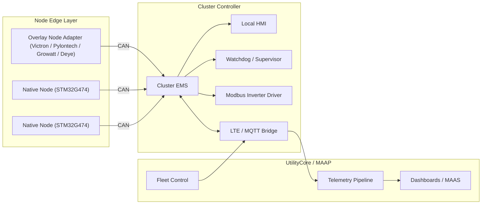

# ClusterStore Master Reference

> Generated: 2026-04-29
> Synthesizes: README.md, clusterStoreDev.md, docs/architecture.md, docs/clusterstore-master-plan.md, docs/current-audit.md, docs/target-state-audit-2026-04-29.md, docs/next-development-roadmap.md, docs/deployment-guide.md, docs/operations-runbook.md, docs/node-deployment-modes.md, docs/master-implementation-walkthrough.md, docs/local-mosquitto-setup.md

This is the single document to understand ClusterStore — what it is, what exists in the repo today, what is working, what is missing, and what comes next.

---

## 1. What ClusterStore Is

ClusterStore is a **clustered BESS management platform**. The idea: instead of one large monolithic battery system, multiple battery nodes — whether custom hardware or existing third-party BESS units — are all coordinated by a single intelligent energy management layer that presents them to the outside world as one unified storage asset.

That unified asset connects upward to **UtilityCore**, the SCADA/monitoring platform where operators see everything.

The system has five layers:

```
[ UtilityCore Cloud ]
        ↕ MQTT over LTE/Ethernet
[ Cluster Controller Cabinet ]
  ├── EMS service (TypeScript)
  └── UtilityCore bridge (TypeScript)
        ↕ FDCAN 500kbps, twisted pair
  ┌─────────────────────────────────┐
  │         CLUSTER CAN BUS         │
  └─────────────────────────────────┘
     ↕              ↕              ↕
[ Node 1 ]    [ Node 2 ]    [ Node 3 ]
Native STM32  Overlay       Overlay
hardware      Pylontech     Victron
```

---

## 2. Node Deployment Modes

### Mode A — Native Node (PowerHive hardware)

```
STM32G474RET6
  -> portable firmware core
  -> BSP / HAL
  -> cluster node controller semantics
```

Each node owns: contactor control, precharge sequencing, current/voltage/temperature measurement, CAN communication, OTA firmware updates.

**Locked decisions:**
- MCU: `STM32G474RET6`
- Bus: `FDCAN1`, `500 kbps` classic CAN for MVP
- Watchdog: `IWDG`
- NVM: internal flash with reserved pages for BCB and journal
- Boot strategy: dual-slot OTA with CRC32, signature-ready headers

**Rough BOM (native node module):** ~$30–50 USD small volumes (electronics only)
- MCU: STM32G474RET6 (~$4)
- CAN transceiver: TJA1051T/3 (~$1)
- Current sensing: INA228AIDGSR I2C 16-bit (~$3)
- Voltage sensing: resistor divider into STM32 ADC1
- Temperature: 2× NTC thermistor into STM32 ADC1
- Contactor drive: 2× GPIO → MOSFET → relay coil
- Power: isolated DC-DC from pack voltage to 3.3V

### Mode B — Overlay Node (wrapping existing BESS)

```
Existing BESS asset (Victron / Pylontech / Growatt / Deye)
  -> Modbus or CAN-BMS adapter
  -> normalized ClusterStore node semantics
  -> Cluster EMS
```

Clips onto existing units via RS485 or VE.Direct. Reads SoC, voltage, current, temperature and translates it into the ClusterStore CAN protocol. The existing BMS still protects the cells.

**The fastest commercial path is overlay mode** — wrap an existing rack, run the controller software on a Pi, connect to UtilityCore. No custom hardware. Deployable in a day.

### Convergence Point

Both modes converge at the Cluster EMS layer. Dispatch, telemetry, alerting, cluster balancing policy, and cloud integration stay unified regardless of the hardware underneath.

---

## 3. Architecture

### System Diagram



### CAN Bus Protocol

Four frame types on the FDCAN bus at 500kbps:

| Frame | Direction | Rate | Content |
|---|---|---|---|
| Heartbeat | node → controller | 1 Hz | node ID, state, SoC, voltage, current, temperature, fault flags |
| Command | controller → node | on demand | START, STOP, FAULT_CLEAR, SET_CHARGE_LIMIT, SET_DISCHARGE_LIMIT |
| Ack | node → controller | on command | accepted / completed / rejected + reason |
| OTA | controller → node | on trigger | firmware image chunks |

### Cluster Node States

- `CLUSTER_SLAVE_CHARGE`
- `CLUSTER_SLAVE_DISCHARGE`
- `CLUSTER_BALANCING`
- `CLUSTER_ISOLATED`

---

## 4. What Each Layer Does

### Layer 1 — Node Firmware (`firmware/`)

The embedded C code that runs on STM32G474 or normalizes overlay assets.

**Native path responsibilities:**
- Battery protection and BMS enforcement
- MPPT and local power conversion loops
- CAN heartbeat, status, diagnostics, and cluster command handling
- Fail-safe when EMS supervision is lost
- Dual-slot OTA boot control
- Non-volatile event journaling

**Overlay path:** Modbus/CAN-BMS adapter reads existing BESS telemetry and translates it into `NodeStatusFrame` semantics. The EMS above never knows the difference.

### Layer 2 — Cluster EMS (`services/cluster-ems/`)

The TypeScript coordination brain running on the cluster controller.

Six continuous responsibilities:

1. **Supervision** — every node must heartbeat within the supervision window. Miss it → node offline, contactors open, fault logged.
2. **Startup sequencing** — discovery → precharge → voltage check → admission. Prevents inrush.
3. **Dispatch** — distributes charge/discharge setpoint across nodes based on SoC balancing.
4. **Fault management** — faults latched as incidents with unique IDs. Deduplicated. Lifecycle: open → acknowledged → resolved.
5. **Remote command handling** — validates TTL, auth metadata, idempotency, target binding before applying. Sends accepted/completed/rejected ack.
6. **Telemetry** — aggregates cluster state every cycle. Buffers on LTE drop, replays in order on reconnect.

### Layer 3 — UtilityCore Bridge (`services/utilitycore-bridge/`)

The MQTT/LTE gateway between the cluster and the outside world.

**Publishes upstream:**
- Cluster telemetry (SoC, power, energy, node count, state)
- Per-node telemetry
- Fault incidents (open/resolved with severity and node ID)
- Command acks

**Receives downstream:**
- Remote commands (force charge/discharge, set limits, stop/start, OTA trigger)
- Configuration updates

**Also:** SCADA fanout to existing site SCADA systems.

### Layer 4 — Shared Contracts (`packages/contracts/`)

TypeScript definitions for:
- CAN frame schema (`can.ts`) — explicit 8-byte wire payload encode/decode aligned to the C firmware
- MQTT topic/payload schema (`mqtt.ts`)
- Shared types (`types.ts`)

### Layer 5 — UtilityCore (above this repo)

Cloud/operator platform. ClusterStore appears as a device with a live dashboard. Operators issue remote commands, acknowledge faults, trigger OTA, view historical data — without knowing about the CAN bus or EMS internals.

---

## 5. Repository Layout (Current, 2026-04-29)

```
.
├── packages/contracts/          # Shared CAN, MQTT, telemetry contracts
│   └── src/                     # can.ts, mqtt.ts, types.ts, index.ts
├── services/
│   ├── cluster-ems/             # EMS daemon, startup-sequencer, fault-manager, dispatch
│   │   ├── src/                 # daemon.ts, runtime.ts, ems-controller.ts, ...
│   │   ├── config/              # daemon.json, live.daemon.json, can-adapter.json, watchdog-adapter.json
│   │   └── dist/                # compiled output
│   └── utilitycore-bridge/      # Bridge daemon, MQTT client, command-router
│       ├── src/                 # bridge-service.ts, command-router.ts, daemon.ts, mqtt-client.ts
│       ├── config/              # daemon.json, secure.daemon.json, mosquitto/
│       └── dist/                # compiled output
├── firmware/
│   ├── clusterstore-firmware/   # Portable native-node workspace (STM32G474)
│   │   ├── lib/                 # boot_control, cluster_platform, journal (host-validated)
│   │   ├── bsp/stm32g474/       # CAN, ADC, INA228, IWDG, flash, BSP drivers
│   │   │   └── cube_generated/  # STM32Cube G4 HAL + generated startup/system files
│   │   ├── app/                 # cs_can_bench, native_node_runtime, board_defaults
│   │   ├── boot/                # bootloader entry
│   │   ├── cmake/               # arm-none-eabi.cmake, host-gcc.cmake
│   │   ├── scripts/             # check-firmware-env.ps1, build-g474-hal.ps1
│   │   └── tests/               # CTest host-side test suite (4/4 passing)
│   └── node-firmware/           # Node-level firmware modules (C, older path)
│       ├── include/             # cluster_*.h headers
│       └── src/                 # cluster_*.c implementations
├── scripts/                     # CLI adapters, smoke runners, audit, MQTT tools
├── tests/                       # all.test.mjs, firmware-binding, overlay-bms-adapter
├── docs/                        # All planning and reference docs (this directory)
├── misc/                        # Private working notes, dev steps
├── .github/workflows/           # CI: npm test + sim:smoke on every push/PR
├── package.json                 # Workspace root, all npm scripts
└── tsconfig.base.json           # TypeScript path config
```

**Note:** `.vendor/STM32CubeG4-v1.6.2/` is excluded from `node_modules` and `misc/` searches. The Cube G4 Drivers tree is imported under `firmware/clusterstore-firmware/bsp/stm32g474/cube_generated/Drivers/`.

---

## 6. Current State Audit (2026-04-29)

This section is the living ground truth of what works and what does not.

### What Passes Locally

| Check | Status |
|---|---|
| `npm run check` (TypeScript) | PASS |
| `npm test` | PASS |
| `npm run build` | PASS |
| `npm run test:firmware-binding` | PASS |
| `npm run test:overlay-adapter` | PASS |
| `npm run sim:smoke` | PASS |
| `npm run smoke:stack` | PASS |
| `npm run check:live-readiness` | PASS (with expected warnings on missing credentials) |
| `firmware:check` (check-firmware-env.ps1) | PASS (C:\tools toolchains present) |
| `firmware:build:arm` (build-g474-hal.ps1) | PASS — produces all 4 ARM images |
| `npm run mqtt:mosquitto:check` | FAIL — mosquitto.exe not installed on this host |

### ARM Build Output

The `build-g474-hal.ps1` script produces:
- `cs_can_bench_g474`
- `cs_native_node_g474_slot_a`
- `cs_native_node_g474_slot_b`
- `cs_bootloader_g474`

### Layer-by-Layer Status

#### Shared Contracts — `packages/contracts/`
**Status: COMPLETE**
- CAN wire payloads aligned between TypeScript and C firmware (explicit 8-byte encode/decode)
- MQTT schema defined
- Round-trip tests pass

#### Cluster EMS — `services/cluster-ems/`
**Status: LOCALLY OPERATIONAL**
- Real daemon entrypoint with HTTP health, snapshot, diagnostics endpoints
- Startup sequencer: IDLE → DISCOVERY → PRECHARGE → PRIMARY_CLOSE → NODE_ADMISSION → VOLTAGE_CHECK → BALANCING → RUNNING
- Fault manager: latched incidents, deduplicated, lifecycle-tracked
- Dispatch: equal-current baseline, SoC-weighted dispatch hooks
- BMS adapter seam for overlay nodes
- Remote command validation: TTL, auth, idempotency, target binding, EMS-side safety checks
- Config loading with `${VAR}` and `${VAR:-default}` placeholder resolution

**Remaining gap:** real CAN data source and real Modbus inverter path require site hardware

#### UtilityCore Bridge — `services/utilitycore-bridge/`
**Status: LOCALLY OPERATIONAL**
- Real daemon entrypoint with MQTT client, buffering, replay
- Command routing with auth, TTL, idempotency
- SCADA fanout
- Secure config with environment-backed secrets and TLS fields
- Smoke stack proves end-to-end MQTT publish through real daemon path

**Remaining gap:** production CA file and MQTT credentials absent (intentional — live-readiness warns)

#### Native STM32 Firmware — `firmware/clusterstore-firmware/`
**Status: HOST-VALIDATED, NOT YET FIELD-PROVEN**
- STM32Cube G4 driver tree imported and wired
- Host CTests pass: 4/4
- ARM build produces all 4 target images
- Bare-metal syscall stubs eliminate `nosys` linker noise
- Clean-configure default prevents stale CMake cache drift

**Known split:** The portable firmware modules in `lib/` are host-validated, but the STM32 images (`app/` and `boot/`) still link through the older `firmware/node-firmware` runtime path. These two need to converge — the code proven on host is not yet the same code that runs on target.

**Remaining gap:** board flash, boot, slot rollback, watchdog, and live FDCAN validation require real NUCLEO-G474RE or production hardware.

#### Node Firmware Modules — `firmware/node-firmware/`
**Status: COMPLETE AS LIBRARY, NOT YET BOUND TO HAL**
- All cluster runtime modules present: `cluster_boot_control`, `cluster_can_protocol`, `cluster_command_manager`, `cluster_contactor_manager`, `cluster_crc32`, `cluster_current_ramp`, `cluster_event_journal`, `cluster_flash_layout`, `cluster_node_controller`, `cluster_ota_manager`, `cluster_platform`, `cluster_state_machine`
- New additions (2026-04-29): `cluster_bootloader_runtime`, `cluster_node_runtime`, `cluster_persistent_state`, `cluster_stm32_boot`, `cluster_stm32_hal`

**Remaining gap:** HAL bindings (FDCAN, GPIO contactors, INA228, ADC, IWDG) need to be wired to the real STM32 BSP.

#### Overlay Node Path
**Status: PARTIAL**
- EMS-side `bms-adapter.ts` seam is working and tested
- Overlay adapter tests pass
- Overlay identifier resolution is correct (was fixed — requires all identifiers to resolve to same asset)

**Remaining gap:** vendor-specific adapters for Victron, Pylontech, Growatt, Deye are not yet built

#### Local MQTT / Mosquitto
**Status: REPO-READY, HOST NOT READY**
- `mqtt:mosquitto:check`, `mqtt:mosquitto:run` npm scripts wired
- `services/utilitycore-bridge/config/mosquitto/local-dev.conf` present
- `scripts/local-mosquitto.ps1` launcher present
- Resolver order: `CLUSTERSTORE_MOSQUITTO_EXE` → PATH → `C:\Program Files\mosquitto\mosquitto.exe`

**Remaining gap:** no `mosquitto.exe` installed on this workstation. Install via `choco install mosquitto` or set `CLUSTERSTORE_MOSQUITTO_EXE`.

#### CI
**Status: CONFIGURED**
- `.github/workflows/ci.yml` runs `npm test` + `npm run sim:smoke` on every push/PR
- TypeScript check gated (skipped until tsc confirmed in CI environment)

### Committed Baseline (as of 2026-04-29)

| Commit | What It Covers |
|---|---|
| `48ebb5f` | EMS + bridge daemons, scripts, tests — full runnable stack |
| `a69d1c8` | CI workflow, in-process test harness, smoke simulator |
| `bfc295c` | Node firmware — platform abstraction, CAN, boot, OTA |
| `8078dda` | Bridge hardening — command routing, telemetry buffering |
| `80189b8` | EMS — startup sequencer, fault manager |
| `f5f2849` | .gitignore update |
| `993932f` | Exclude .claude/ from version control |
| `6dee1d6` | Docs — architecture, master-plan, ops, deployment, roadmap docs |
| `ade6c3a` | clusterstore-firmware BSP build, HAL config, syscalls, HAL drivers |
| `1ff493d` | node-firmware STM32 HAL binding, boot, runtime, persistent state |
| `913bb48` | contracts package.json + tsconfig updates |

---

## 7. What Is Still Missing Before First Pilot

These are the true blockers. They are no longer missing implementation — they are site-side and hardware-side work.

### Hardware Blockers (cannot be faked from the repo)

1. `mosquitto.exe` installed on controller host for real local broker
2. Real MQTT CA certificate placed at `CLUSTERSTORE_MQTT_CA_CERT_PATH`
3. Real MQTT credentials (`CLUSTERSTORE_MQTT_USERNAME`, `CLUSTERSTORE_MQTT_PASSWORD`)
4. CAN adapter physically connected to real site nodes
5. Watchdog adapter connected to real local supervisor
6. Real Modbus inverter register map proven against actual unit
7. LTE modem outage and replay exercised on real modem path
8. STM32 images flashed and validated on NUCLEO-G474RE or production board

### Software Convergence Blockers

1. **Firmware runtime convergence** — collapse the split between `firmware/clusterstore-firmware/lib/` (host-validated portable core) and the STM32 image entry points in `app/` + `boot/` which still link through `firmware/node-firmware/`. Both must use the same core.
2. **Overlay vendor adapters** — Victron, Pylontech, Growatt, Deye-specific implementations
3. **Persistent backing store** — in-memory telemetry buffer and event queue need durable controller storage (SQLite or filesystem journal) for production
4. **Secure provisioning** — credential rotation, CA/client-cert provisioning, per-device identity enrollment, signed OTA artifacts
5. **EMS state persistence** — EMS does not survive a controller reboot with full state intact

### Minimum Pilot Checklist

- [ ] CAN wire protocol frozen and HIL-tested
- [ ] Modbus profile frozen for first supported inverter
- [ ] Safe equalization and contactor sequencing HIL-tested
- [ ] Independent safety supervisor and watchdog behavior proven
- [ ] Durable telemetry and event storage on controller
- [ ] Secure and auditable remote command path
- [ ] Commissioning workflow and maintenance lockout
- [ ] Alarm dedupe, latch, acknowledge, clear lifecycle
- [ ] Local HMI for offline field diagnostics
- [ ] Simulator and HIL coverage for key failure modes

---

## 8. Development Roadmap

### Priority 0 — Site-Proving (unlocks real pilot)

1. HIL validation for CAN, inverter, watchdog, LTE paths
2. Real inverter register-map validation
3. Real broker TLS validation with certificates, ACLs
4. STM32 board flash, boot, rollback, watchdog, FDCAN validation on hardware

Done when: deployment guide can be executed end to end on a real site without placeholder values.

### Priority 1 — Native Firmware Convergence

1. Collapse duplicated runtime — STM32 images consume same core modules proven in host tests
2. HIL tests for boot-control, journal recovery, CAN supervision timeout
3. Freeze first production BSP contract for STM32G474

Done when: code proven in host tests is the same core used in target images.

### Priority 2 — Overlay Node Commercial Path

1. Vendor-specific adapter: Victron
2. Vendor-specific adapter: Pylontech
3. Vendor-specific adapter: Deye or Growatt (first customer target)
4. Adapter qualification fixtures and replay tests

Done when: at least one third-party BESS can participate in EMS with no per-site code changes.

### Priority 3 — Security and Provisioning

1. Secret injection and rotation for MQTT credentials
2. CA and client-certificate provisioning workflow
3. Per-device identity and bootstrap enrollment
4. Signed OTA artifact flow for firmware and controller services
5. Auditable operator acknowledgement and command approval flow

Done when: deployment does not rely on static placeholder secrets or manual credential placement.

### Priority 4 — Operations and Observability

1. Site commissioning checklist automation
2. Controller metrics and service-health dashboarding
3. Journal export and field-service diagnostics tooling
4. Brownout and black-start replay testing
5. Release packaging for controller deployments

Done when: field support can diagnose and recover a site without repo-level manual digging.

### Priority 5 — Fleet and Commercial Layer

1. UtilityCore asset model and dashboard templates
2. Incident workflow and escalation rules
3. Tariff-aware dispatch policy engine
4. Degradation and cycle analytics
5. Service and maintenance records

---

## 9. Operations Quick Reference

### One-Command Local Audit

```cmd
cmd /c npm run audit:full
```

Runs in order: `check` → `test` → `build` → `test:firmware-binding` → `test:overlay-adapter` → `sim:smoke` → `smoke:stack` → `check:live-readiness` → `firmware:check` → `firmware:build:arm`

### Firmware Build

```powershell
powershell -ExecutionPolicy Bypass -File firmware/clusterstore-firmware/scripts/check-firmware-env.ps1
powershell -ExecutionPolicy Bypass -File firmware/clusterstore-firmware/scripts/build-g474-hal.ps1
```

Use `-ReuseBuildDirectory` flag only for intentional incremental builds. Default is clean configure.

### Start Local Daemons (fake broker)

```cmd
cmd /c npm run smoke:stack
```

Starts: fake MQTT broker + EMS daemon + bridge daemon + file-backed state inputs. Verifies health endpoints and MQTT publish.

### Start Local Daemons (real Mosquitto)

```cmd
cmd /c npm run mqtt:mosquitto:check
cmd /c npm run mqtt:mosquitto:run
```

Then in separate terminals:
```cmd
cmd /c npm run start:ems
cmd /c npm run start:bridge
```

### Live Config Validation

```cmd
cmd /c npm run check:live-readiness
node scripts/live-readiness-check.mjs --ems services/cluster-ems/config/example.live.daemon.json --bridge services/utilitycore-bridge/config/example.secure.daemon.json --probe
```

### Config Files

| Purpose | Path |
|---|---|
| EMS local dev | `services/cluster-ems/config/daemon.json` |
| EMS live | `services/cluster-ems/config/live.daemon.json` |
| EMS CAN adapter | `services/cluster-ems/config/can-adapter.json` |
| EMS watchdog adapter | `services/cluster-ems/config/watchdog-adapter.json` |
| Bridge local dev | `services/utilitycore-bridge/config/daemon.json` |
| Bridge secure/production | `services/utilitycore-bridge/config/secure.daemon.json` |
| Local Mosquitto config | `services/utilitycore-bridge/config/mosquitto/local-dev.conf` |

---

## 10. Deployment Sequence (Summary)

Full detail in `docs/deployment-guide.md`.

1. **Prepare controller host** — `npm install` → `npm run audit:full`
2. **Fill environment variables** — all `CLUSTERSTORE_*` vars in `.env` or shell
3. **Prepare runtime inputs** — CA cert, CAN adapter paths, watchdog paths, Modbus map, MQTT requester policy
4. **Validate site config** — `check:live-readiness` + `--probe`
5. **Bring up services** — EMS daemon → bridge daemon, verify health endpoints
6. **Commission external systems** — CAN, Modbus, MQTT TLS, LTE outage/replay, watchdog
7. **Flash and validate firmware** — bootloader → slot A/B image → boot validation on hardware

**Exit criteria before calling production-ready:**
- All checks, builds, tests, smoke, firmware builds green
- `check:live-readiness` reports no failures
- CA cert and MQTT credentials are real
- CAN adapter emits real node status frames
- Modbus map proven against actual inverter
- Bridge publishes telemetry and processes safe command round-trip
- LTE buffering and recovery exercised on real modem
- Watchdog consumed by real supervisor
- STM32 images flashed and validated on hardware

---

## 11. Key Design Decisions (Locked)

| Decision | Rationale |
|---|---|
| Keep STM32Cube G4 in baseline | ARM build depends on imported HAL driver tree and Cube-generated startup files. Remove only after first board bring-up and HIL validation. |
| Overlay mode is the commercial MVP path | No custom hardware, deploys on existing BESS in a day, same EMS behavior above the adapter boundary |
| CAN wire format is explicit 8-byte encode/decode | Eliminates struct-layout ABI risk between TypeScript contracts and C firmware |
| Faults are latched as incidents with unique IDs | Prevents alert storm on reconnect; enables operator acknowledge/resolve lifecycle |
| Commands require TTL, auth, idempotency, target binding | Prevents stale/replayed/misdirected commands from reaching hardware |
| Telemetry buffered in-memory with ack-gated drain | No silent data loss on LTE drop; replay in order on reconnect |
| Firmware split: portable `lib/` vs. older `node-firmware/` runtime | Portable lib is host-validated reference; STM32 images still link older path — convergence is Priority 1 |

---

## 12. Innovation Opportunities (Future)

1. **Self-Healing Cluster Control** — automatic node quarantine, dynamic rebalancing, cluster resilience scoring
2. **Digital Twin and Replay** — site replay engine for postmortem, simulation-backed commissioning, fleet anomaly library
3. **Economic Intelligence** — tariff-aware dispatch, solar/load forecasting, backup-reserve and export optimization
4. **Predictive Reliability** — contactor wear estimation, thermal stress modelling, resistance drift monitoring
5. **Offline-First Field Operations** — full local technician mode, QR-guided commissioning, auto maintenance reports
6. **Fleet-Level MAAS** — policy-driven fleet across all clusters, analytics-backed MAAS tiers, VPP participation via MAAP
